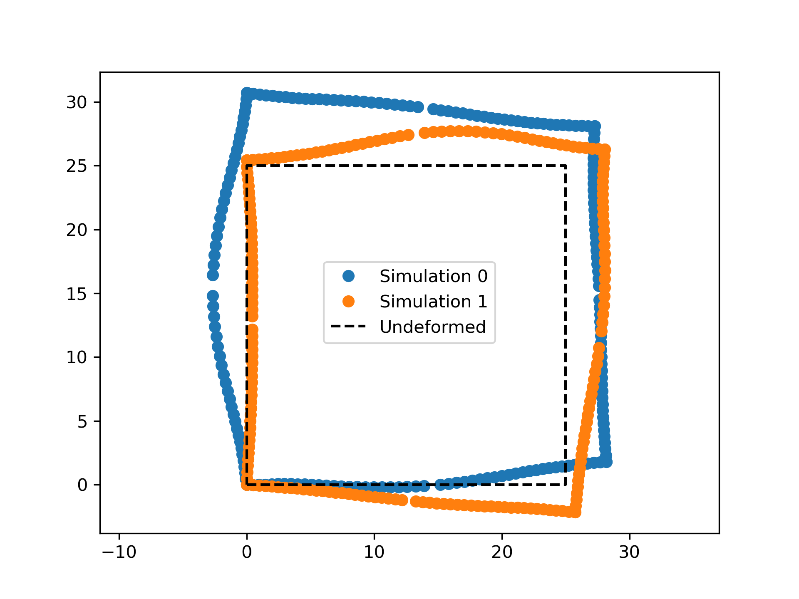

# Marc Mentat Scripting
A how-to guide for scripting marc mentat using python API.

This README will contain an overview of the provided example. Each script is relatively well documented and commented.

There is a section at the bottom of this README with some useful tips and tricks. There are a couple of quirks that mentat has which I have figured out how to get around.

### File definitions
| Extension  | File function |
| ------------- | ------------- |
| .proc | This is the Mentat input file. We create this file and then run it to build the model. |
| .dat  | This is the input file to the solver (Marc).  |
| .t16  | Results file - can be processed in mentat or using `py_post`.  |
| .sts  | Status file - file is updated whilst being solved. After completion, the exit code is found at the bottom of this file.  |
| .x_t  | Not sure, have never used it. |
| .mud  | Marc Binary Model File - I do not use this file in my scripting pipeline. |

## Example - Create unit with a rectangular void and generate a .dat file.

### Resulting deformations.
I start with the resulting defomation images to show what the final result should look like.

1. The `create_model.py` first creates the rectangle cavity that will be placed in the unit. This makes use of the `create_rectangle` function in this script.
2. Once the rectangle has been generated, the `create_model.py` script will call  the `create_rectangle_proc_dat` function in the `create_rectangle_proc_dat.py` script. This function will create the `.proc` files.
    1. The `.proc` files are all basically the same so the commands have been hardcoded and only the model specific parameters are changed.
    2. The parameters values come from two locations.
        1. The `config.ini` file.
        2. The nodal locations as a result of the rectangle cavity geomentry.
3. Once the `.proc` files have been generated they can be run in background mode using the commant `mentat -bg <file_name>.proc` in the terminal. This will create the `.dat` files.
4. The `.dat` files can then be sovled with Marc using the command `run_marc -j <file_name>.dat`. This will create the `.t16` and `.sts` files.
    1. Note: The `mentat` and `run_marc` commands have to be run for each file. When I have many files on the HPC I have a bash script that does this for me.
    2. The `.sts` files contain the information for each incriemnt of the simulation and can be monitored to see the progress of the simulation.
5. Once the simulation is complete the `py_post_process.py` can be run which will extract the final nodal positions of each of the prescribed nodal target locations and place it in a text file.
    1. I have simply prescribed the outer edge of the unit as the nodal targets in this example. This is done in the `set_up_node_targets` function.
    2. If a simulation failed, or a file is missing the name of the failed or missing file is placed in the `failed_files.txt` and `missing_files.txt` files respectively.
    3. The extracted nodal positions are stored in the text file using the convention x0, x1, x2, ...., xn, y0, y1, y2, ...., yn. Where each new line is a new simulation. (This is usefull to me for the Monte-Carlo simulations I run).
### Generating the rectangle cavity.
Mentat can create a polygon by placing node points in a specified winding order. The `create_rectangle` function takes in the $x$ & $y$ center coordinates, aspect ratio, rotation angle, and area, and returns the coordinates of the four verticies. These verticies are then passed to mentat to create the polygon.
    1. Care needs to be taken to ensure that the verticies fall within the desired domain. I have some functions that do this for me, but they are not included in this example.
    2. When running an optimisation I also just leave this for the optimisation constraints to handle.

### Creating the model in Mentat using .proc files.
We cannot directly alter the `.dat` files if have a changing geometry. Therefore we will create a `.proc` file and let mentat set up the model for us in the background using `mentat -bg <file_name>.proc`.
    1. The `-bg` flag can be left out and then mentat will open and all the commands will be generated in the GUI. This is usefull to see whats actaully happening.
    2. When generating many `.dat` files I have found it more efficient to combine all the `.proc' files into one and then just run it. I have set the `.proc` files up in such a way that this is possible. The `.proc` files close and open the required models as needed.
## Tips and Tricks

1. When passing nodes to mentat to create a polygon, the order in which they are passed is important. The nodes must be passed in a clockwise/counterclockwise order (not sure which one). If you pass the nodes in the wrong order, mentat will give an error. A simple solution to this is to check if the area of the polygon is negative when using the shoelace area formula. This is especially usefull when working with irregulat polygons with many nodes.
2. When post processing the files with mentat the .mud file is expected to be in the same directory. However, I have found that even though mentat gives an error it its not there, it still works. Therefore I just ignore the .mud files to save on a bit of space.
3. When using Windows and pressing <tab> to autocomplete the file name a `.\` is added to the start of the file name. This causes mentat to give an error. Therefore be sure to remove it when running mentat.
4. Marc and Mentat create alot of files. I try to keep a folder where all of these are placed to avoid bloating my working directory.
5. Marc and mentat will dump thier files within the directory the files are called from, i.e., where the .proc file is located when run.
6. I append all the commands to create model into a single .proc file. This is the most efficient way I have found to generate a lot of .dat files in the case of a Monte-Carlo simulation scenario.